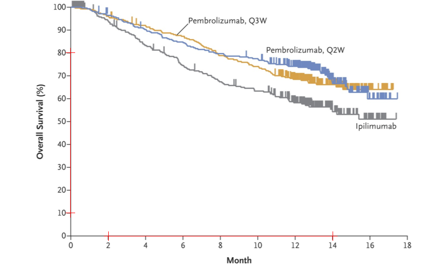
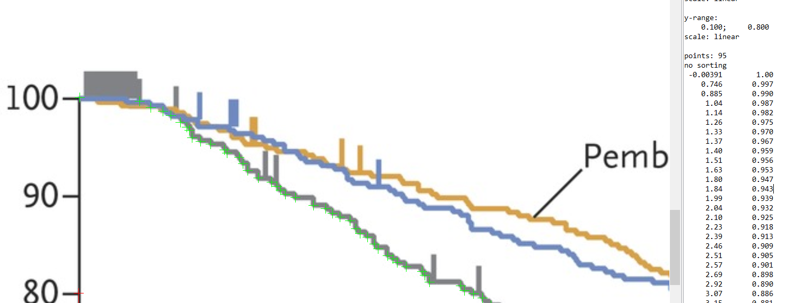
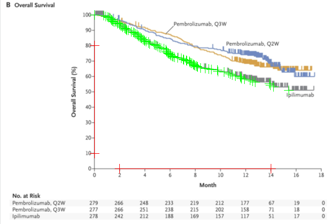
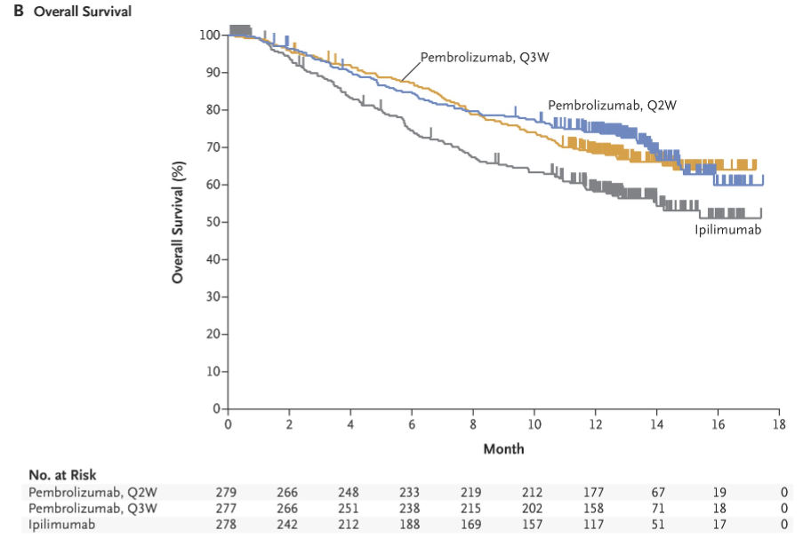

# Can't Wait Trying?

```{r, echo = FALSE, message = FALSE, warning=FALSE, child="part1.Rmd"}
library(shinyapps4clinicaltrial)
app_dir <- system.file("shiny-examples", "reconstruct-survival-data", package = "shinyapps4clinicaltrial")
x1 <- file.path(app_dir, "www/data_all_arms.csv")  
ex_df1 <- readr::read_csv(x1)
head(ex_df1)
ex_df2 <- readr::read_csv("data/data_nar.csv")
ex_df3 <- reconstruct_survival_data(data_click = ex_df1, data_nar = ex_df2)
arms <- unique(ex_df3$arm)
ex_df3 <- ex_df3 %>% mutate(arm = factor(arm, levels = arms[c(2, 3, 1)])) %>% arrange(arm)
```


At this point, you might be eager to try reconstructing survival data with a KM
curve in which you are particularly interested. 

The shiny App implemented here requires two data sets --- the **risk table** and
the **click data** as input. Jointly, they will be used to derive the subject
level event time and censor status. The **risk table** is usually easy to
obtain, since most KM-curve figures report such data along with the plot itself.
The majority, and of course, most time-consuming work, is to obtain the **click data**.

Below I will demonstrate to you (1) use digitizer software (e.g.
[DigitizeIt](https://www.digitizeit.de/) or [WebPlotDigitizer](https://automeris.io/WebPlotDigitizer/)) to extrapolate time ($x$-axis) and
survival probability ($y$-axis) in the KM plots, and (2) collect number
at risk (NAR) information.


# Obtain Click Data

## Extrapolate Data with DigitizeIt

After installing the DigitizeIt software into your laptop, you would use it to
open the figure that contains the KM-curve of interest.


$\underline{Tip:\space for\space the\space following\space steps,\space I\space suggest\space you\space zoom\space in\space the\space figure\space large\space enough}$

  * Step 1: Identify the scalar on $x$- and $y$-axis. This is done by clicking
  "*Axis*" --> "*X min*", and then locate the red cross sign at the place you
  want to start on the $x$-axis. Note, *X min* can be any number that you want
  to locate along the axis. Similarly, you locate *X max*. Once done, DigitizeIt
  will draw a straight line between *X min* and *X max*, which is the scalar on
  the $x$-axis. Next you'll complete the scalar on $y$-axis. A snapshot will
  look like below:
  
```{r pressure, echo=FALSE, fig.cap="", out.width = '80%'}

```
  
* Step 2: Identify event time along the KM curve. Your first click should be at
the (0,1) coordinate, and all other clicks should come at the **leftmost point
of each horizontal line segment**. 

    + An example is shown below, first you click
```{r, echo=FALSE, fig.cap="", out.width = '80%'}

```

    + The resulting figure after you complete all clicks looks like below
```{r, echo=FALSE, fig.cap="", out.width = '80%'}

```


Once you have finished the clicks, you may save the data as `.csv` file by
choosing "*File*" --> "*Export as CSV*". Next, you manually save the risk table
in a `.csv` file.


Note: although the clicks are not required to be done sequentially along the
$x$-axis or $y$-axis, you do need to make sure that if the click data is sort by
$x$ in ascending order, $y$ correspondingly should be in descending order.

## Prepare Click Data for Format Requirement 
This shiny app takes specific format for the input data. Specifically,   
  + click data should contain the following 3 columns
    - `time` the first column of data from the above figure. **Note**: make sure
    the first entry is 0. (you may manually change it if the click is not accurate.)
    - `survival` the second column of data from the above figure. **Note**: make 
    sure the first entry is 1. (also, you may manually change it if the click is not accurate.)
    - `arm` which arm does the click come from.
 Using DigitizeIt, each arm will export a `.csv` file, and you'll need to bind all
 the arms to obtain a single click data set. You may add as many arms as you like.
 
 Here is an example of click data: 
 
```{r, echo = FALSE, warning=FALSE}

knitr::kable(ex_df1 %>% slice(c(1:5, 96:100, 171:175))) %>% kableExtra::kable_styling()
```
 
  + risk table
    - `time` copied from the risk table
    -  for other columns, each correspond to events of that arm. You can have as
    many columns as you like.
    - the name of each column should **EXCATLY** match the name of the `arm` in
    the click data. eg, if `unique(arm)` are *Ipilimumab*, *Pembrolizumab, Q3W*
    and *Pembrolizumab, Q2W*, your column header for risk table should be
    exactly *Ipilimumab*, *Pembrolizumab, Q3W* and *Pembrolizumab, Q2W*
    - Neither the order of the columns nor that of the rows should matter.
  
    
  A glimpse of the risk table would be like this:    
  
```{r, echo = FALSE, warning=FALSE}

knitr::kable(ex_df2) %>% kableExtra::kable_styling()
```
   
   
# Reconstruct Data 

Once you have prepared the input data in the format desired, you can upload it 
into the shiny app, the app will take the job of data reconstruction. The
algorithm is based on the work of  @guyot2012enhanced, and this implementation 
adopted the code from [reconstructKM](https://github.com/ryanrsun/reconstructKM).

The output of the above data should look like 


```{r, echo = FALSE, warning=FALSE}

knitr::kable(ex_df3 %>% slice(c(1:5, 301:305, 671:675))) %>% kableExtra::kable_styling()
```
 
You can use the resulting data to obtain the estimate of interest. As in this 
example, the KM curve we reconstructed is shown below 

```{r, echo = FALSE, fig.width = 8, fig.height = 6}
show_reconstruct_km(recon_data = ex_df3, data_nar = ex_df2)
```

Here is the original KM curve see @robert2015pembrolizumab

```{r, echo=FALSE, fig.cap="", out.width = '85%'}

```

# Bugs and Issue Report
Should you experience any error message, or you have any suggestion to improve this shiny app, please do not hesitate to contact **Bin Zhuo** <bzhuo@amgen.com> or **Tony Jiang** <xunj@amgen.com> at Modeling and Simulation Team, Design & Innovation. 

# Reference 
 
    
    